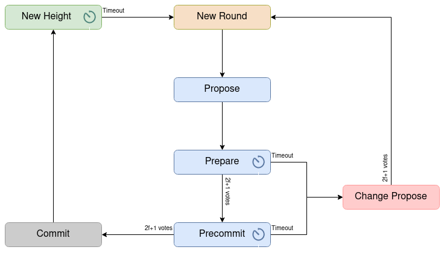

# Consensus as state machine

Zarb consensus algorithm is a state machine replication with Byzantine fault tolerance. The best way
to implement and test the state machines is using
[state pattern](https://en.wikipedia.org/wiki/State_pattern).

## Consensus states

Consensus protocol in Zarb considered these states:

- New Height state
- New Round state
- Propose state
- Prepare state
- Precommit state
- Commit state
- Proposer change state

At each time consensus is in one of the these state.

