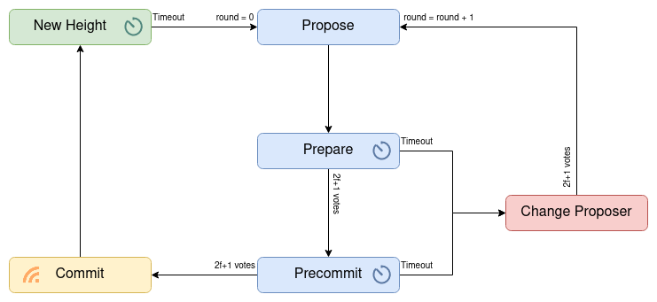

## State machine

Zarb consensus algorithm is a state machine [^first] replication with Byzantine fault tolerance. The
consensus algorithm is in one the following states [^second] at any given time.

- New Height state
- Propose state
- Proposer change state
- Prepare state
- Precommit state
- Commit state

[^first]: [State machines](https://en.wikipedia.org/wiki/Finite-state_machine)
[^second]:
    [James Rumbaugh](https://en.wikipedia.org/wiki/James_Rumbaugh) defines state that: "A state is
    an abstraction of the attribute values and links of an object. Sets of values are grouped
    together into a state according to properties that affect the gross behavior of the object."
