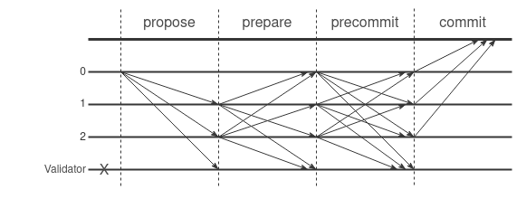

# Consensus Mechanism

## The algorithm

The Zarb Consensus algorithm is highly spired by Practical Byzantine Fault Tolerant (PBFT)[^first]
alghorithm. Practical Byzantine Fault Tolerant, or in short PBFT "presents a new, practical
algorithm for state machine replication that tolerates Byzantine faults."

There are $R = 3f+1$ replicas. where $f$ is the maximum number of replicas that may be faulty or
byzantine. For example if there is one faulty replica, the resiliency of the algorithm is optimal if
we have at least 3 non-faulty replicas. So the minimum number of replicas should be $3+1=4$.

In each round one replica is the proposer and the others are validators.

The normal case operation of Zarb consensus algorithm includes these three steps: **propose**,
**prepare** and **precommit**

### Propose phase

A proposer ($P$) collects transactions and creating a proposal block. It signs and broadcasts a
_proposal_ message with block piggybacked to all the validators.

Proposal message has this form:

$<<PROPOSAL,h,r,d>_{\sigma p}, B>$

where:

- $B$ is proposed block
- $d$ is proposal's digest or hash
- $h$ indicates the block height
- $r$ is a assigned round number, which is zero for the first round

### Prepare phase

If validator $i$ accepts the proposal, it enters _prepare_ phase and signs and broadcasts _prepare_
message to all other validators. Otherwise, it does nothing.

Prepare message has this form:

$<PREPARE,h,r,d,i>_{\sigma i}>$

If validator $i$ received $2f+1$ prepare messages from other validators (possibly including its
own), it is **prepared** and enters to precommit phase.

### precommit phase

In _precommit_ phase, validator $i$ signs and broadcasts _precommit_ message to the other
validators.

Precommit message has this form:

$<PRECOMMIT,h,r,d,i>_{\sigma i}>$

Each validator executes and commits block $b$ after receiving $2f+1$ precommit messages (possibly
including its own) and becomes **committed**.

All the message in above steps are cryptographically signed and all replicas know the others’ public
keys to verify signatures.

Picture below shows the operation of the algorithm in the normal case of no primary faults. Replica
0 is the proposer, replica 3 is faulty.

## Block announcement

Each validator that receives a valid proposal and with $2f+1$ precommit messages can make a
certificate and broadcasts _block_announce_ messages with the block and certificate piggybacked to
network.

$<BLOCK-ANNOUNCE,h,r,B,C>$

where:

- $C$ is the block certificate

Validators can move to the next height and clear the message logs after receiving valid
_block_announce_ message.

## Proposer change

The proposer-change protocol provides liveness by allowing the system to make progress when the
proposer fails. Proposer changes are triggered by timeouts that prevent validators from waiting
indefinitely for proposal to execute.

If the timer of validator expires in a round, the validator starts a proposer-change phase to move
the system to round $r+1$. It stops accepting messages (other than proposer-change and
block-announce messages) and broadcasts a proposer-change message to all validators.

proposer-change message has this form:

$<PROPOSER-CHANGE,h,r,i>_{\sigma i}>$

If the proposer for round $r+1$ receives $2f+1$ valid proposer-change messages for round $r$ from
other validators, it goes to next round and broadcasts proposal message.

[^first]:
    [Practical Byzantine Fault Tolerance - whitepaper](http://pmg.csail.mit.edu/papers/osdi99.pdf)
