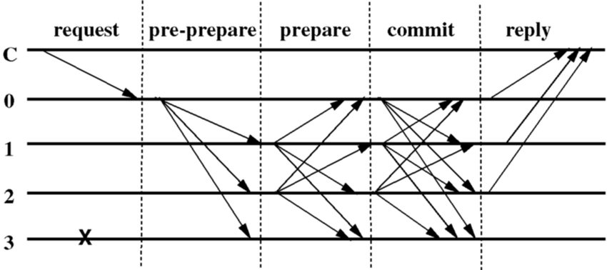

# Consensus Engine

## Practical Byzantine Fault Tolerant

Zarb is based on Proof-of-Stake and uses Practical Byzantine Fault Tolerant (PBFT) for its consensus engine. There are other protocols for consensus engine like Paxos and Raft. However Paxos and Raft protocols aren’t Byzantine fault tolerant. The original paper is published on 1999. "This paper presents a new, practical algorithm for state machine replication that tolerates Byzantine faults."

In PBFT

1. A client sends a request to invoke a service operation to the primary (P)
2. The primary multicasts the request to the backups
3. Replicas execute the request and send a reply to the client
4. The client waits for 3f+1 replies from different replicas with the same result; this is the result of the operation.

3f+1 means if there are f nodes that has a byzantine failure, there has to be more than 3f+1 nodes in order for the system to be byzantine fault tolerant.

When the primary receives a client request it starts a three-phase protocol to atomically multicast the request to the replicas. The three phases are pre-prepare, prepare, and commit.

The algorithm provides both safety and liveness assuming no more than 3f+1 replicas are faulty.

Picture below shows the operation of the algorithm in the normal case of no primary faults. Replica 0 is the primary, replica 3 is faulty, and C is the client.

## Zarb Consensus Engine

The main idea is based on preparing the block with some sequence (increasing on each round) and stages for voting and committing the proposed block. To commit a block at least 2/3 of validators should sign the proposal block.

### No-Delegation

In PoW nodes are competing with each other to mine a new block. In PoS nodes are collaborating to mint a block. This collaboration can not be endless. You can’t open the parliament door (Majlis) and ask anyone to join. The size of validator set should be fix and pre-defined. In the other hand having fixed validator set will cause delegation mechanism. After a while no one can join to the set, and finally some delegators will control the blockchain. People with more money have more power. Zarb solved this problem by introducing flexible and dynamic validator set: Byzantine agreement of Prof of Stake .
Using VRF (Verifiable Random Function) we can implement a dynamic validator set. In each round each validator outside the set runs a VRF function which the seed is the previous block id. The result is deterministic and Zero Knowledge provable. A validator based on its stake and its chance can enter the set for the next round. The formula is quite simple:

*which*

: VRF output between 0~1

: Total stake

If the result is less than the validator stake, then this validator is eligible to enter to the set for the next height. The validator needs to send a Sortition transaction with the proof of VRF. This transaction is valid for 21 blocks. When a validator enters the set the lasts validator should leave the set to make it balance.

