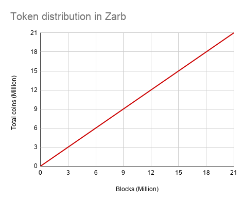

# Incentive

## Deflationary Economic Model

Zarb is a deflationary blockchain, same as in the case of Bitcoin. The total number of coins in Zarb 
is 21 million and it is set at genesis time. Zarb does not have any pre-minted token or privileged account.

## Flat Reward

The incentive may help encourage nodes to stay honest[^first]. To have a better understanding about 
the incentive model in Zarb, let's do a comparison with the Bitcoin incentive and reward 
distribution model. We will use this comparison to show the difference. We love Bitcoin and Bitcoin 
is the king.

| Zarb                                             | Bitcoin                                      |
| ------------------------------------------------ | -------------------------------------------- |
| Consensus engine is Proof of Stake               | Consensus engine is Proof of Work            |
| _Exactly_ every 10 seconds one block is _minted_ | Around every 10 minutes one block is _mined_ |
| Total supply is 21,000,000 coin                  | Total supply is 21,000,000 coin              |
| Always one coin per block                        | Initial block reward is 50 coin              |
| No halving                                       | Halving happens every 4 years                |

The way Bitcoin distributes the tokens is a good solution for Proof-of-Work blockchain. Early 
contributors in Bitcoin collect most of the tokens. This scheme in Proof-of-Stake blockchain will 
damage the network by powering early contributors. Simply because the validators are weighed by 
their stake. More stake, more power.

In Zarb, the token distribution is flat. It means the reward for each block is fixed and does not change 
over time. There is no halving in Zarb. The flat reward is a part of the consensus parameters and, for
the main net, it sets one coin per block.

## Treasury Account

A Treasury account is a special account and is defined at the genesis time. The treasury account at the 
genesis time holds the total coins (21 million).

## Reward Transaction

The first transaction in each block is the reward transaction.

[^first]: [Bitcoin: A Peer-to-Peer Electronic Cash System](https://bitcoin.org/bitcoin.pdf)
