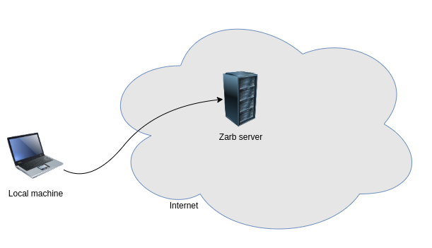

# Deploy using Ansible

## 🎮 What is Ansible?

::: quote

Ansible is all about automation, it requires instructions to accomplish each job. With everything
written down in simple script form, it's easy to do version control.

In Ansible, there are two computers: the **control node** and **managed nodes**. The control node is
your computer that runs Ansible. A managed node is any device being managed by the control node.

::: right

From [OpenSource.com](https://opensource.com/resources/what-ansible)

:::

## Why ansible?



TODO:

## Step by Step

Make sure you have installed Ansible in your local machine and you have access to your server
through ssh.

If you have installed firewall in your server machine, make sure these port are open:

- 8421 -> for p2p network
- 8080 -> gRPC gateway
- 9090 -> gRPC


First you need to clone this repository:

```

```

Run `ansible gathering-fact` to make sure ansible works fine.

Now, you need to generate two keys in your local machine. One for validator and another for
collecting the rewards. If you have [compiled Zarb](./run-compile.md) you can use Zarb command to
generate keys, otherwise use [docker](./run-docker.md) file in your local machine.

Now, let's create ansible Vault. Ansible Vault encrypts variables and files so you can protect
sensitive content such as secret keys.

Let's create a vault and add validator private key inside the vault.
You can use inspect command to copy the private key.

```
ansible-vault encrypt_string --vault-id key_vault@prompt key_vault.yml
```
Set a strong password for vault and then paste private key.

Ansible will encrypt the key and save inside `key_vault.yml`

One more step, open the config file and update `MintbaseAddress`.
This can be different than validator address.

Now we are ready to deploy the Zarb.

First make sure ansible works fine:

```
```