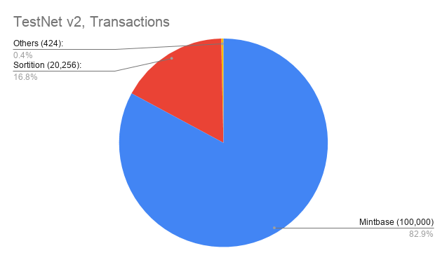
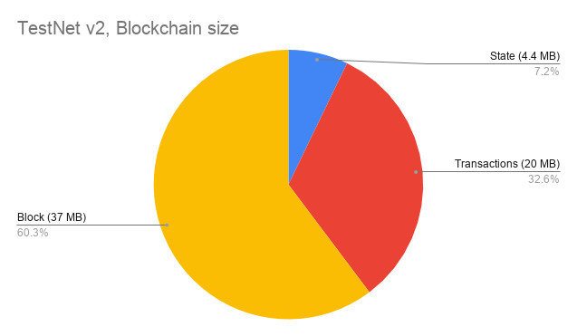

# The story of TestNets

Zarb is under heavy testing right now. Here is brief history of our testnets.

## TestNet version 1:

It ran with 4 validators. The goal was testing stability of consensus engine.

## TestNet version 2:

It ran with 7 nodes and the [committee](./learn-committee.md) size set to 4. The goal was testing
the sortition algorithm and networking module. Here is some statistic, after 100,000 blocks:

- Number of block: **100,000 blocks**
- Total number of transactions: **120,680 transactions**
- Size of blockchain: **61 MegaBytes**

## TestNet version 3:

Currently we are running the third TestNet. It has 15 validators and the size of
[committee](./learn-committee.md) is 11.
