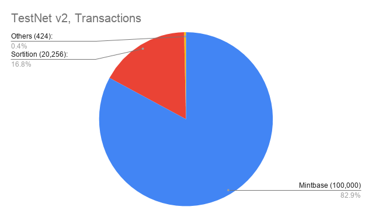
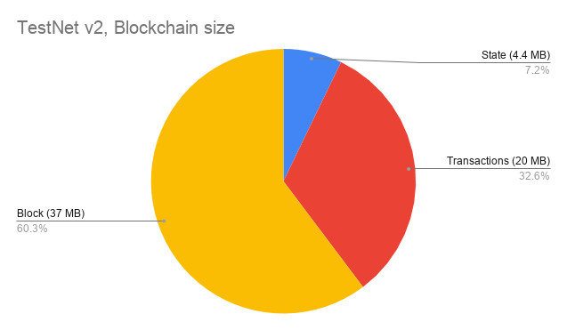

# The story of TestNets

Here is brief history of Zarb testnets:

## TestNet version 1:

The first testNet launched with only 4 validators. The goal was testing stability of the consensus
engine.

## TestNet version 2:

The second testNet launched with 7 validators and the [committee](./learn-committee.md) size set
to 4. The goal was testing the sortition algorithm, networking and state modules. Here is some
statistic, after 100,000 blocks:

- Number of block: **100,000 blocks**
- Total number of transactions: **120,680 transactions**
- Size of blockchain: **61 MegaBytes**

## TestNet version 3:

The third testNet launched with 11 nodes in different time zones. Some of the nodes configured to be
faulty and sending malicious messages. The goal was testing liveness and stability of the network in
faulty situations. The TestNet could successfully commit 130 thousands blocks.

## TestNet version 4:

Currently we are running testnet version 4 with 1t 15 validators. The goal is testing sortition
algorithm in real situation.
