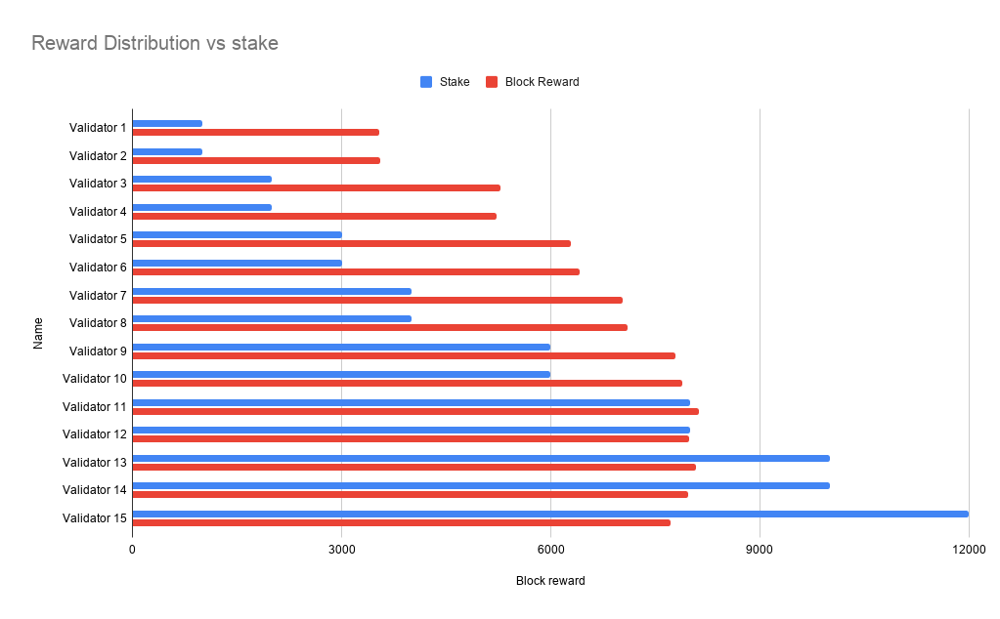

# Story of TestNets

Here is brief history of Zarb testnets:

## TestNet Version 1:

The first testNet was launched with only 4 validators. The goal was testing the stability of the
consensus engine

## TestNet Version 2:

The second testNet wasa launched with 7 validators and the [committee](./learn-committee.md) size
set to 4. The goal was testing the sortition algorithm, networking and state modules. The Size of
blockchain was about **60 MegaBytes** after 100,000 blocks.

## TestNet Version 3:

The third testNet was launched with 11 nodes in different time zones. Some of the nodes are
configured to be faulty and send malicious messages. The goal was to test the liveness and stability
of the network in faulty situations. The TestNet could successfully commit 130 thousands blocks.

## TestNet Version 4:

TestNet version 4 was launched with 15 validators. The goal was testing the sortition algorithm and
reward distribution in the real situations. In this table you can see the statistics after 100,000
blocks:

| Validator    | Stake  | Stake % | Reward | Reward % |
| ------------ | ------ | ------- | ------ | -------- |
| Validator 1  | 1,000  | 1.25    | 3,544  | 3.54     |
| Validator 2  | 1,000  | 1.25    | 3,558  | 3.56     |
| Validator 3  | 2,000  | 2.50    | 5,284  | 5.29     |
| Validator 4  | 2,000  | 2.50    | 5,220  | 5.22     |
| Validator 5  | 3,000  | 3.75    | 6,290  | 6.29     |
| Validator 6  | 3,000  | 3.75    | 6,418  | 6.41     |
| Validator 7  | 4,000  | 5.00    | 7,024  | 7.02     |
| Validator 8  | 4,000  | 5.00    | 7,104  | 7.10     |
| Validator 9  | 6,000  | 7.50    | 7,795  | 7.79     |
| Validator 10 | 6,000  | 7.50    | 7,890  | 7.89     |
| Validator 11 | 8,000  | 10.00   | 8,130  | 8.13     |
| Validator 12 | 8,000  | 10.00   | 7,978  | 7.98     |
| Validator 13 | 10,000 | 12.50   | 8,080  | 8.08     |
| Validator 14 | 10,000 | 12.50   | 7,970  | 7.97     |
| Validator 15 | 12,000 | 15.00   | 7,715  | 7.71     |
| Total        | 80000  | 100.00  | 100000 | 100.00   |

As you can see, the reward distribution looks fair. The validator 1 with only 1.25% stake could get
3.54% of the total rewards. This helps the new validators collects coins even they have less bonded
stake. in the other hand validator with more stake collect more rewards.

The mainnet also should follow the same pattern. Hopefully ✌️
