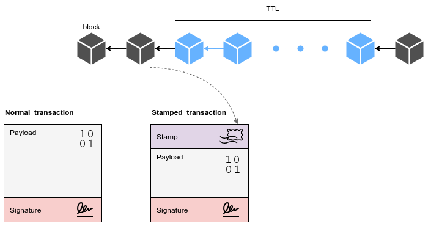

# Stamping Transactions

## What Is A Stamping Transaction?

_Stamping a transaction_ simply means putting the previous block hash into the header of the
transaction. A stamped transaction, unlike normal transactions, has a lifetime (TTL) and it is only
valid for a certain time. If $TTL = N$, the stamped transaction after N blocks
will be invalid.

By stamping transactions, we can decouple transactions from the block. There is no need to save the
whole transaction inside a block. Keeping the transaction hash is fair enough.

### How to Validate a Stamped Transaction

A stamped transaction can easily be verified. The first step is finding the block with the
corresponding stamp (block hash). If it doesn’t exist, it means the transaction is not valid. If the
block is found, we need to iterate over the next `N` blocks to find the transaction hash. If the
transaction hash is found, it is valid. Otherwise, the transaction is invalid.

Tx is valid if:

$hash(tx) ∊ Block[S:S+N]$

where: $Block[S] = tx.stamp$

## Consequences

- **Reducing the size of mempool**

  Each stamped transaction has a lifetime and the transaction will be invalid after a certain time.
  It can help manage the mempool better and avoid keeping transactions with low fees forever.

- **Preventing any possible forks**

  Stamped transactions are loyal to the main fork. Any possible fork needs to re-stamp the
  transactions and therefore re-sign them, which is not feasible. This feature especially can
  mitigate _Nothing at stake_ and _long range_ attacks for Proof-of-Stake blockchains. There is no
  solution to overcome long range attacks in PoS blockchain. Stamping transactions can mitigate this
  issue by binding transactions to the main fork.

## References

- [Analysis of Bitcoin Transaction Size Trends](https://tradeblock.com/blog/analysis-of-bitcoin-transaction-size-trends)
- [Light Clients and Proof of Stake](https://blog.ethereum.org/2015/01/10/light-clients-proof-stake/)
- [A Survey on Long-Range Attacks for Proof of Stake Protocols](https://ieeexplore.ieee.org/stamp/stamp.jsp?arnumber=8653269)
