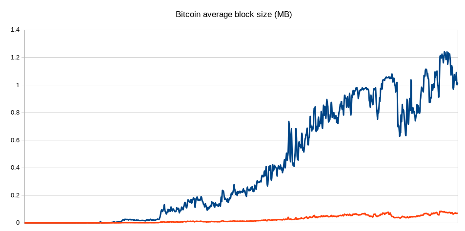
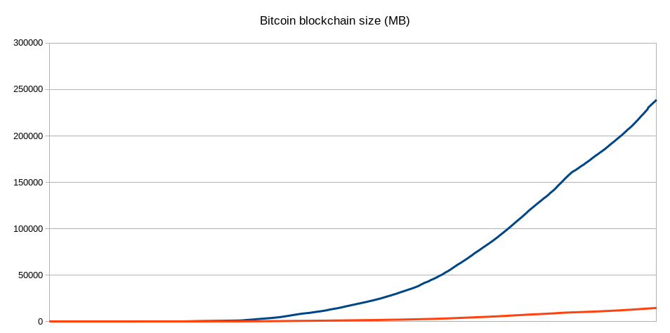

# Stamping transactions

## What is stamping transaction?

_Stamping a transaction_ simply means putting the previous block hash into the header of the
transaction. A _stamped transaction_ unlike normal transactions has a lifetime (TTL) and it's only
valid for a certain time. If `TTL = N`, the stamped transaction after `N` blocks will be invalid.

By stamping transactions we can decouple transactions from the block. There is no need to save the
whole transaction inside a block and keeping the transaction hash is fair enough.


### How to Validate a stamped transaction

A stamped transaction easily can be verified. The first step is finding the block with the
corresponding stamp (block hash). If it doesn’t exist it means the transaction is not valid. If the
block is found, we need to iterate over the next `N` blocks to find the transaction hash. If the
transaction hash found, it is valid otherwise the transaction is invalid.

```
tx is valid if:

hash(tx) ∊ Block[S:S+N]

where:
  Block[S] = tx.stamp

```

### Where stamped transactions will be saved?

Full nodes can have a separate database for saving stamped transactions. This database will only be
used for querying transactions. A node can choose to save all txs, part of them or nothing. Nodes
can query transactions by hash from each other. Users also can save their own transactions in their
own wallets.

### Can a stamped transaction be lost?

Probably yes and it's not a curse. Should we care about a transaction that happened 10 years ago and
try to keep it in our DB? By decoupling transactions from the block, transactions will have their
own way to survive.

## Consequences

- **Reducing the size of blockchain**

  Stamping transactions can reduce the block size dramatically. For keeping a stamped transaction
  inside a block we need to store only 32 bytes of hash of transaction instead of whole transaction
  data. In bitcoin, the average transaction size has increased from 450 bytes in Jan 2013 to almost
  600 bytes in Oct 2015. In the below charts you can see how stamped transaction could reduce the
  size of bitcoin blockchain if it had applied from the genesis block:

  

  

- **Reducing the size of mempool**

  Each stamped transaction has a lifetime and the transaction will be invalid after a certain time.
  It can help manage the mempool better and avoid keeping transactions with low free forever.

- **Preventing any possible forks**

  Stamped transactions are loyal to the main fork. Any possible fork needs to re-stamp the
  transactions and therefore re-sign them which is not feasible. This feature specially can mitigate
  _Nothing at stake_ and _long range_ attacks for Proof of Stake blockchains. There is no solution
  to overcome long range attacks in PoS blockchain. Stamping transactions can mitigate this issue by
  binding transactions to the main fork.

## References

- [Analysis of Bitcoin Transaction Size Trends](https://tradeblock.com/blog/analysis-of-bitcoin-transaction-size-trends)
- [Light Clients and Proof of Stake](https://blog.ethereum.org/2015/01/10/light-clients-proof-stake/)
- [A Survey on Long-Range Attacks for Proof of Stake Protocols](https://ieeexplore.ieee.org/stamp/stamp.jsp?arnumber=8653269)
