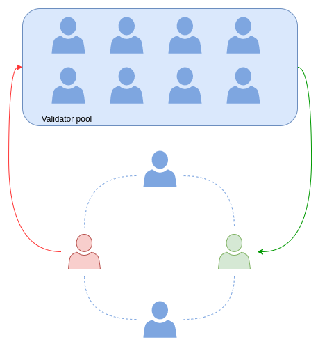

# Consensus without delegation

## Proof of Stake

Zarb is a real Proof of Stake blockchain. Proof of Stake is a way to secure the network through
requesting users to stake some amount of their coins.

## A paradox

Unlike Proof of Work, which is based on competition between miners, Proof-of-Stake is based on
cooperation between validators. Validators work together to validate a block, like a team or
committee. A good player will be incentivized and a bad actor will be punished and fired from the
team. However, the question is how big can this team or committee be?

If your committee gets bigger and bigger, the voting time will be longer and longer and also the
committee will be more vulnerable to the network partition attack. For example, some calculations
show that with more than 100 validators, a PoS blockchain becomes less efficient. On the other hand,
a small committee of validators makes blockchain insecure and vulnerable to attacks. A PoS
blockchain will be more secure and decentralized if more validators participated in it. This creates
a paradox in PoS blockchain. We can't get big, but we need to get big!

The block size is also another issue when the number of validators increases. Validators must put
their signature information in each block as proof of the commitment. As long as more than ⅔ of
validators sign a block, the block will be committed into the blockchain. Increasing the size of the
committee will increase the size of the blocks and, therefore, the blockchain gets bigger. Some
blockchains solve this issue by defining archive nodes. But archive nodes tend to be centralized
which is against the blockchain philosophy: Nothing should be centralized.

## Delegated Proof of Stake

Some blockchains address this paradox by defining delegation. In Delegated Proof of Stake (dPoS),
people put their stakes in the hands of a group of “delegates” and these delegates validate
transactions and produce blocks.

But how can voters trust a delegate? If a delegate is acting badly, what will happen? You can stake
your token in favor of good actors but you still need a minimum trust on this platform. However,
once again, this goes against the blockchain philosophy, trust nobody.

For example in the EOS blockchain, there is
[constitution](https://github.com/EOSIO/eos/blob/5068823fbc8a8f7d29733309c0496438c339f7dc/constitution.md)
for the people participating in the blockchain. This constitution is full of “shall” and “shall
not”. In the long run, the blockchain will be ruled by a powerful organization and won’t be
decentralized anymore.

## Zarb Has No Delegation

The solution we are offering in Zarb is creating a **dynamic set** of validators. Validators can be
changed randomly. Anyone can easily become a validator by staking some tokens. At each height, every
validator starts running a Verifiable Random Function (VRF) in order to choose themselves. The VRF
is unpredictable and the result can be verified cryptographically by other validators.

Based on their stake and their luck, a validator can be in the [committee](../basic/committee) for
the next run. Once a validator enters the committee, the oldest validator in the committee leave.

