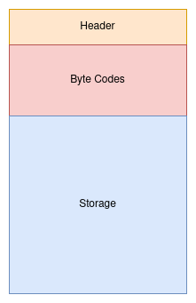
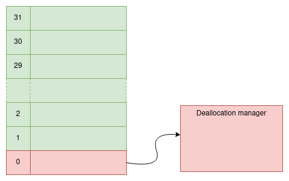

# Storage as file

## Motivation

Ethereum friendly blockchains keep storage in a separate key/value database per request. This has
some drawbacks:

- Since there is a global database that stores all storages, the storage key is a combination of
  <span v-pre>$Key_{contract} + Key_{item}$</span> that is a bit messy.
- Storage data can’t have any meta data, because they are scattered in different places in the
  key/value database.
- Storages per smart contract can’t be Merklized. Ethereum came with another solution to calculate
  the hash of the whole storage. They defined a hexary Patricia tree that is quite
  [suboptimal](https://twitter.com/VitalikButerin/status/1239359499963695106).

Here we discuss how we can address the above issues by dedicating a separate file as **Storage
File** per smart contract. In this scenario, users should purchase the storage file with required
capacity before deploying the smart contract. Once the purchase is done, a separate empty file will
be created and dedicated for the user. The size of the file is the same as the purchase size. For
example users can purchase 10 MB or 120 MB of storage files depending on their need and renew them
yearly.

## Structure

Each storage file has three parts: Header, ByteCodes and contract storage.



The Header of the storage file keeps some meta data like storage file index, last payment time,
total storage size, etc. In the ByteCodes section the byte codes of the smart contract will be saved
and in the storage section, the actual storage of the smart contract will be stored.

## Storage APIs

Smart contracts can only change data in storage sections. To achieve that the smart contract
executer (virtual machine) should introduce these APIs:

```rust
/// This API requests the host to read the slice of `data` from the storage file
/// at the given `offset`.
fn read(&self, offset: u32, data: &mut [u8]) -> Result<(), HostError>;

/// This API requests the host to write  the slice of `data` into the storage file
/// at the given `offset`
fn write(&self, offset: u32, data: &[u8]) -> Result<(), HostError>;

```

These APIs are similar to `SLoad` and `SStore` opcodes in Ethereum Virtual Machine (EVM). But
instead of key and value, they accept offset and data parameters.

## Storage Allocation

In order to allocate storage space safely and efficiently user can use these predefined methods:

```rust
/// Allocates storage space with the specific `length` and returns the
/// offset of allocated space in the storage file.
pub fn allocate(&self, length: u32) -> Result<Offset, Error>;

/// Deallocates the storage space at the specific `offset` and `length`
pub fn deallocate(&self, offset: Offset, length: u32) -> Result<(), Error>;

/// Reallocates the the storage space at the given `offset` from `length` to `new_length`
/// and returns the new offset of reallocated area.
pub fn reallocate(&self, offset: Offset, length: u32, new_length: u32) -> Result<Offset, Error>;
```

## Storage Stack

There is a fixed stack with 32 elements at the beginning of the storage . The first item in this
stack is reserved and used for managing deallocated storage spaces. Users can use other stack items
to keep the offset of the allocated spaces for the smart contract variables.



## Data collections

Usually in smart contracts developers are interested in data collections like Search Trees or Hash
Tables to look up values by the associated keys. Most programming languages come up with some
builtin collections, however we can’t use them in smart contracts because they use RAM that is
inconsistent. However we can have storage equivalent of these data collections that instead of
dealing with memory they are dealing with the storage file. You can naively consider storage as
dedicated consistent memory for the smart contract.

Right now these data collection is available to use inside the smart contract: `StorageVector`,
`StorageString`, `StorageLinkedList` and `StorageBST`

<!-- <TODO: link to docs.rs> -->

## Merklizing Storage

To make sure all the nodes have the same state we need to calculate the hash of all storage files.
Merkle tree can help us to easily calculate the root hash very fast. We need two Merkle trees, one
for calculating the root hash of each storage file and the second for calculating the root hash of
all storage files.

### Single storage file Merkle tree

We can divide each file into small chunks of data and calculate the hash of each chunk once. Since
we know exactly which chunk has changed after executing the smart, contract we can easily
reconstruct the tree and calculate the merle root again.

### Whole storage Merkle tree

Each file has a unique index. With using that index we can make sure that the position of the leaf
nodes in the Merkle tree is always the same. The same technique we used for calculating the
[state root](../basic/state-root.md).


## Example

As an example we have implemented the ERC20 smart contract based on this idea. The implementation
can be found [here](https://github.com/zarbchain/kelk/tree/main/examples/erc20)

## Testing

One of the consequences of Storage as File is that testing smart contracts becomes easier. What we
need is only to mock the storage file.
