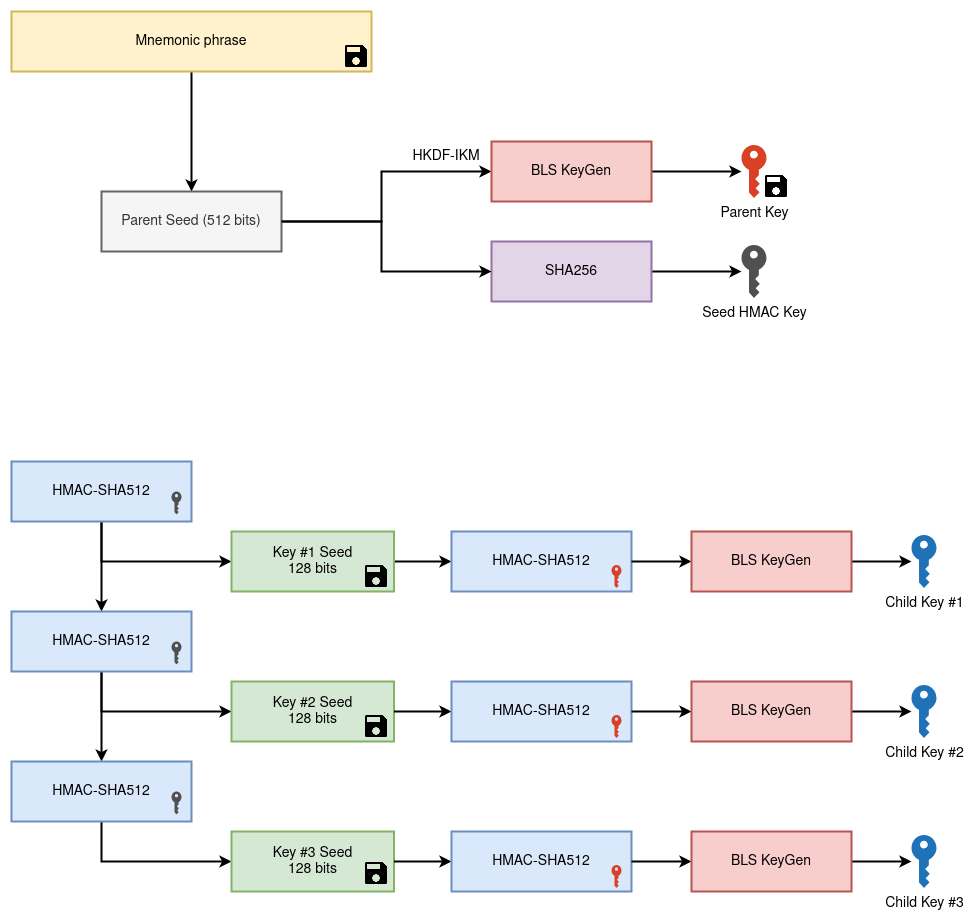

# Key generation

## KDF chain

A KDF chain is a core concept in the Key generation algorithm.

Key derivation function or KDF is short is a cryptographic function that takes a secret and random
key and some input data and returns output data. The output data is indistinguishable from random
provided key.

We use the term KDF chain when some of the output from a KDF is used as an output key and some is
used for input data for the next KDF. The below diagram represents a KDF chain processing three
keys:

For more information please check the implementation.