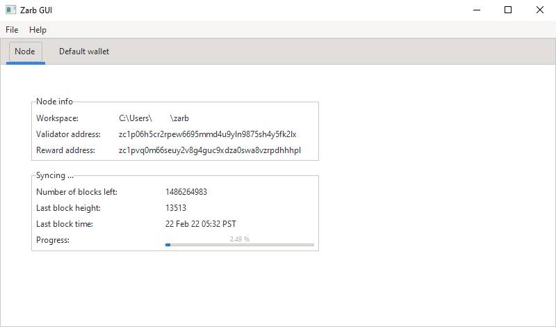

# How to run Zarb (GUI)

You can run Zarb in Graphical User Interface (GUI) mode.

## Initializing Working Directory

If you are running Zarb for the first time, there is an assistant page that help you to initialize your node.

## Running the node

After initializing the working directory, you can run the node and start syncing with the testnet.

